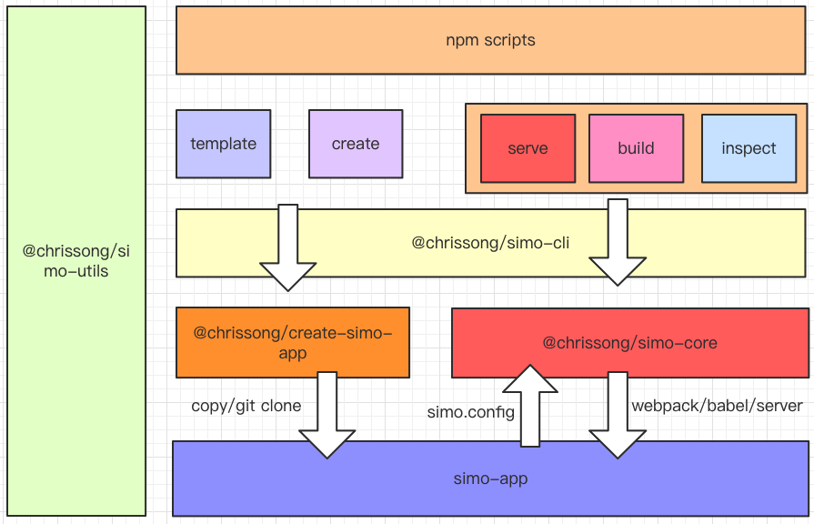

# @chrissong/simo-cli 的介绍以及对前端构建的思考

## 初衷

- 打造一个用起来顺手的脚手架搭建工具；
- 对项目的搭建、开发、打包以及代码编写有所规范和统一；
- 对新的技术的学习和理解；

## 介绍

### 项目

依赖于`yarn workspace` 和 `learn` 的`Monorepo`项目库；好处在于可以统一管理每个 package 的依赖安装，构建打包，发布等，每个 package 可以直接引用实时编译代码；

### 架构

 

### 功能

#### 支持 Ts

`babel-typescript` 用于 ts 代码编译 ，`fork-ts-checker-webpack-plugin` 用于 ts 类型检查，将会创建子进程用于 ts 的类型分析；

#### webpack 链式配置

`webpack-chain` 创建一个 config 实例，所有的配置都可以直接调用实例提供的方法，

#### CSS Modules

依赖于`babel-auto-css-modules` 自动为`js import style from './style.css' ` 方式引入的 css 文件开启 `css modules`。

#### 开发服务热重启

开发服务由 `webpack-dev-server` 在子进程中创建，当主进程在监听到配置文件有所变化，将会杀死当前运行的子进程服务，并重新创建新的服务；

#### 编译性能优化

- `thread-loader` 对 `babel` 的编译单独开启进程；
- `terser-webpack-plugin` 对于 js 代码的压缩默认开启多进程；
- `babel-loader` 开启缓存；
- `webpack` 使用磁盘缓存；

#### react 组件热更新

基于 `@pmmmwh/react-refresh-webpack-plugin` 和 `react-refresh/babel`实现，相比于`react-hot-loader`有无代码入侵，React 官方维护和支持 hooks 的优点。

#### 默认对于 less 和 sass 支持

依赖 `less` 和 `sass（dart-sass）`对于 less/sass 文件的编译，相比与 `node-sass` 使用 `sass` 更快编译。

## 关于在 IE 中使用

目前 webpack 默认打包出来的代码只在仅由支持 es6 语法的现代浏览器使用，在 ie 中需要引入相关的 `core-js` 内模块

## 扩展

结合项目开发规范和使用场景场景，开发几种合适的项目模版 `simo-template-pro`

## 展望

- 微内核，功能插件化；
- 基于 `antd` 和 `less` 实现换肤方案；
- 内置了对于 md 文档的处理，考虑文档构建工具方向；
